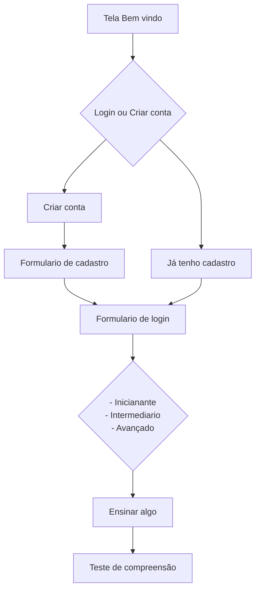

# Prova Senai

## Título: Aprender vocabulário básico em inglês

- **Como** um usuário iniciante interessado em aprender inglês
- **Eu quero** utilizar um sistema simples para aprender vocabulário básico
- **Para que** eu possa melhorar minha compreensão e comunicação no idioma inglês.

### Detalhamento da história de usuário:

1. Tela de Boas-Vindas e Registro:

**Descrição**: Apresenta uma mensagem de boas-vindas e oferece a opção de registro ou login para o usuário.

**Funcionalidades**: Campos para cadastro de novo usuário ou login para acesso à plataforma.

2. Seleção de Nível de Dificuldade:

**Descrição**: Permite que o usuário escolha o nível de dificuldade do vocabulário a ser aprendido.

**Funcionalidades**: Opções para iniciantes, intermediários e avançados, adaptando o conteúdo conforme o nível selecionado.

3. Exibição de Palavras e Frases:

**Descrição**: Apresenta palavras em inglês com suas traduções ou frases simples no idioma alvo.

**Funcionalidades**: Exibe a palavra ou frase acompanhada de sua pronúncia, imagem ilustrativa (se aplicável) e opção para ouvir a pronúncia.

4. Testes de Compreensão:

**Descrição**: Oferece pequenos testes para verificar a compreensão do vocabulário aprendido.

**Funcionalidades**: Questões de múltipla escolha, preenchimento de lacunas ou associação de imagens com palavras/frases.

5. Progresso e Estatísticas:

**Descrição**: Mostra o progresso do usuário e estatísticas sobre seu desempenho.

**Funcionalidades**: Indicadores visuais que exibem o progresso na aprendizagem, número de palavras aprendidas, testes realizados e pontuações.
6. Perfil do Usuário:

**Descrição**: Permite ao usuário visualizar e editar seu perfil, incluindo suas preferências de aprendizado.

## Telas a serem feitas
- [ ] [Tela 1 - Boas vindas](/prova_senai/lib/pages/welcome.dart)
- [ ] [Opção cadastro ou login](/prova_senai/lib/pages/welcome.dart)
	- [ ] [Formulário cadastro](/prova_senai/lib/pages/singup.page.dart)
	- [x] [Formulário de Login](/prova_senai/lib/pages/login.page.dart)
- [ ] Seleção Nível de dificuldade
- [ ] Tela ensinando algo em inglês
- [ ] Teste de compreensão (Questões de múltiplas escolhas)
- [ ] Sidebar
    - [ ] [Tela de progressos](/prova_senai/lib/pages/progress.dart)
    - [ ] [Tela de perfil de acesso](/prova_senai/lib/pages/profile.dart)
        (Poder atualizar os dados do perfil)

## Referencia
- 
- 

---

