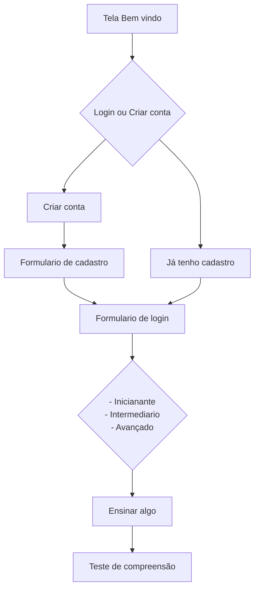

# Prova Senai

## Telas a serem feitas
- [ ] [Tela 1 - Boas vindas](/prova_senai/lib/pages/welcome.dart)
- [ ] [Opção cadastro ou login](/prova_senai/lib/pages/welcome.dart)
	- [ ] [Formulário cadastro](/prova_senai/lib/pages/singup.page.dart)
	- [ ] [Formulário de Login](/prova_senai/lib/pages/login.page.dart)
- [ ] Seleção Nível de dificuldade
- [ ] Tela ensinando algo em inglês
- [ ] Teste de compreensão (Questões de múltiplas escolhas)
- [ ] Sidebar
    - [ ] [Tela de progressos](/prova_senai/lib/pages/progress.dart)
    - [ ] [Tela de perfil de acesso](/prova_senai/lib/pages/profile.dart)
        (Poder atualizar os dados do perfil)

## Referencia
- 
- 

---

