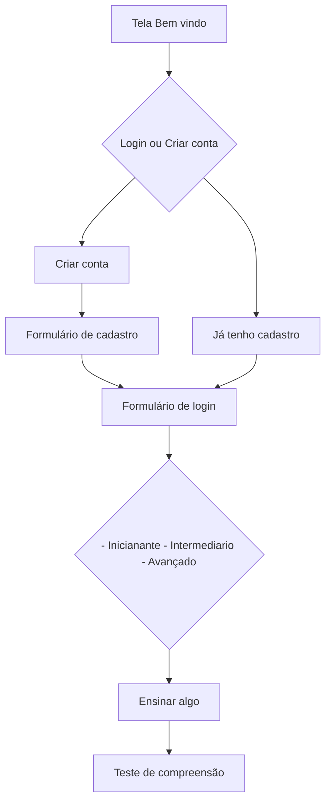

# Prova Mobile - Senai

## Como rodar o projeto


### Pré-requisitos
- Certifique-se de ter o Flutter instalado em sua máquina. Para informações sobre como instalar o Flutter, consulte a [documentação oficial do Flutter](https://flutter.dev/docs/get-started/install).

### Passos para executar o projeto

1. **Clone o repositório:**
   ```bash
   git clone https://github.com/LucasGFBatista/senai-prova-mobile.git

   cd prova_senai
   ```

2. **Instale as dependências:**
   ```bash
   flutter pub get
   ```

3. **Execute o aplicativo:**
   ```bash
   flutter run
   ```
   Certifique-se de que um emulador esteja em execução ou que um dispositivo físico esteja conectado.

4. **Explore o aplicativo:**
   O aplicativo será iniciado no dispositivo/emulador, e você poderá explorar as diferentes telas conforme a descrição fornecida no arquivo README.>)


## 1ª Etapa do projeto
### Título: Aprender vocabulário básico em inglês

- **Como** um usuário iniciante interessado em aprender inglês
- **Eu quero** utilizar um sistema simples para aprender vocabulário básico
- **Para que** eu possa melhorar minha compreensão e comunicação no idioma inglês.

#### Detalhamento da história de usuário:

1. Tela de Boas-Vindas e Registro:

**Descrição**: Apresenta uma mensagem de boas-vindas e oferece a opção de registro ou login para o usuário.

**Funcionalidades**: Campos para cadastro de novo usuário ou login para acesso à plataforma.

2. Seleção de Nível de Dificuldade:

**Descrição**: Permite que o usuário escolha o nível de dificuldade do vocabulário a ser aprendido.

**Funcionalidades**: Opções para iniciantes, intermediários e avançados, adaptando o conteúdo conforme o nível selecionado.

3. Exibição de Palavras e Frases:

**Descrição**: Apresenta palavras em inglês com suas traduções ou frases simples no idioma alvo.

**Funcionalidades**: Exibe a palavra ou frase acompanhada de sua pronúncia, imagem ilustrativa (se aplicável) e opção para ouvir a pronúncia.

4. Testes de Compreensão:

**Descrição**: Oferece pequenos testes para verificar a compreensão do vocabulário aprendido.

**Funcionalidades**: Questões de múltipla escolha, preenchimento de lacunas ou associação de imagens com palavras/frases.

5. Progresso e Estatísticas:

**Descrição**: Mostra o progresso do usuário e estatísticas sobre seu desempenho.

**Funcionalidades**: Indicadores visuais que exibem o progresso na aprendizagem, número de palavras aprendidas, testes realizados e pontuações.
6. Perfil do Usuário:

**Descrição**: Permite ao usuário visualizar e editar seu perfil, incluindo suas preferências de aprendizado.

## 2ª Etapa do projeto

**Data de Entrega:23/12/2023**
Uma equipe de desenvolvedores de aplicativos móveis está atualmente trabalhando em um projeto. O aplicativo que estão construindo requer uma tela de login para que os usuários acessem suas contas.

A primeira etapa do projeto é criar uma tela de login com opções para os usuários inserirem seus nomes de usuário e senhas. A equipe deseja que a interface seja intuitiva e fácil de usar, seguindo as diretrizes de design do Material Design do Flutter.

Conscientes da importância da segurança das credenciais dos usuários, a equipe decide implementar uma solução de armazenamento local usando o SQFlite, um pacote de banco de dados SQLite para Flutter. Eles planejam criar uma tabela no banco de dados para armazenar com segurança os dados de login dos usuários.

A equipe trabalha na lógica de verificação de login, utilizando consultas ao banco de dados local por meio do SQFlite. Eles se concentram em garantir a segurança das consultas e verificar se os dados inseridos pelos usuários correspondem às informações armazenadas no banco de dados.

Além da tela de login, a equipe está planejando incluir funcionalidades de recuperação de senha e registro de novos usuários. Para a recuperação de senha, eles estão considerando opções, redefinição de senha para os usuários registrados. Para o registro de novos usuários, eles estão projetando uma tela de cadastro com campos para inserção de informações pessoais e de login.

A equipe está comprometida em criar uma experiência de usuário perfeita. Eles dedicam tempo para garantir que as funcionalidades de recuperação de senha e registro de novos usuários sejam implementadas de forma a oferecer uma experiência tranquila e amigável aos usuários do aplicativo.

Após a implementação das funcionalidades, a equipe realiza testes rigorosos para verificar se tudo funciona conforme o esperado. Eles estão confiantes de que a tela de login, recuperação de senha e registro de novo usuário oferecem uma experiência segura e eficaz para os usuários do aplicativo que estão desenvolvendo.


## O que tem que ser feito
### 1ª Etapa [Documento 1ª Etapa](/prova_senai/assets/AvaliacaoTipo2.pdf)
- [x] [Tela 1 - Boas vindas](/prova_senai/lib/pages/welcome.dart)
- [x] [Opção cadastro ou login](/prova_senai/lib/pages/welcome.dart)
	- [x] [Formulário cadastro](/prova_senai/lib/pages/singup.page.dart)
	- [x] [Formulário de Login](/prova_senai/lib/pages/login.page.dart)
- [x] [Seleção Nível de dificuldade](/prova_senai/lib/pages/levels.page.dart)
- [ ] Tela ensinando algo em inglês
- [ ] Teste de compreensão (Questões de múltiplas escolhas)
- [ ] Sidebar
    - [ ] [Tela de progressos](/prova_senai/lib/pages/progress.dart)
    - [ ] [Tela de perfil de acesso](/prova_senai/lib/pages/profile.page.dart)
        (Poder atualizar os dados do perfil)

### 2ª Etapa [Documento 2ª Etapa](/prova_senai/assets/Segunda%20Etapa%20do%20Projeto.pdf)
- [x] [Formulário cadastro](/prova_senai/lib/pages/singup.page.dart)
- [x] [Formulário de Login](/prova_senai/lib/pages/login.page.dart)
- [ ] [Tela de recuperação de senha]()


### Possivel Fluxo do sistema




## Referencia
- 
- 

